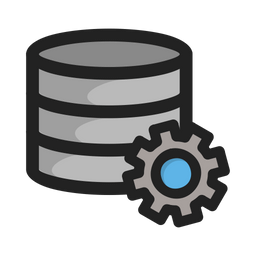

# Santander Coders - Etapa de Inscrição

  

## Sumário

- [Sobre a inscrição](#sobre-a-inscrição)
- [Sobre o teste de conhecimento](#sobre-o-teste-de-conhecimento)
- [Outras dicas](#outras-dicas)
- [Sobre a escolha da trilha](#sobre-a-escolha-da-trilha)
  - [Angular](#angular)
  - [Data Engineering](#data-engineering)
  - [Data Science](#data-science)
  - [Java](#java)
- [Confirmação da Inscrição](#confirmação-da-inscrição)
- [O que fazer durante a espera pelo resultado?](#o-que-fazer-durante-a-espera-pelo-resultado)
- [Parabenização pela aprovação](#parabenização-pela-aprovação)
- [Licença](#licença)

## Sobre a inscrição

A Santander Coders tem sido amplamente divulgada em diversos meios de comunicação, incluindo redes sociais, sites de notícias e grupos de WhatsApp, como uma excelente oportunidade de capacitação profissional para aqueles que almejam ingressar no mercado de trabalho na área de tecnologia. É crucial estar atento ao período de inscrições, pois na última edição do programa, as inscrições ocorreram entre 01/03/2023 e 01/05/2023.

## Sobre o teste de conhecimento

Ainda no formulário de inscrição, serão apresentadas algumas perguntas sobre conhecimentos gerais. É de extrema importância que você acerte todas as questões, pois elas serão utilizadas como critério de desempate. Na última edição foram ofertadas 50.000 bolsas para a continuidade no processo seletivo, não sabendo a dimensão de quantas pessoas podem se inscrever para o programa, é importante que você se destaque desde o início.

## Outras dicas

- Leia atentamente o edital do programa, lá você encontrará informações importantes sobre o processo seletivo. Inclusive sobre como todas as etapas serão avaliadas. Há muitos desentendimentos e confusões que podem ser evitadas com a leitura do edital.
- Não deixe para se inscrever no último dia, imprevistos podem acontecer e você pode acabar perdendo o prazo.
- Esteja bem ciente da escolha da sua trilha de conhecimento, pois não será possível alterá-la após a inscrição.

## Sobre a escolha da trilha

Com base na última edição, foram ofertadas para escolha 4 trilhas: Angular, Data Engineering, Data Science e Java. Todas com de carga horária de 324h. Alguns critérios que podem ser levados em consideração na hora da escolha:

- Afinidade com a área profissional vinculada a trilha.
- Experiência prévia com atividades relacionadas.
- Como o mercado de trabalho está para a área.

A princípio ao longo do processo seletivo, você não terá contato com a trilha escolhida, então não se preocupe se você não tiver conhecimento prévio sobre a área. O importante é que você tenha afinidade com a área escolhida, pois você terá que se dedicar bastante para aprender e se destacar no processo seletivo.

No decorrer das etapas, você perceberá pessoas com diferentes perfis e objetivos. Algumas pessoas já possuem experiência na área, outras estão em busca de uma recolocação no mercado de trabalho, outras estão em busca de uma primeira oportunidade. O importante é que você esteja ciente do seu objetivo e que você se dedique para alcançá-lo.

### Angular

  

A trilha de Angular é voltada para quem busca se tornar um desenvolvedor front-end. O Angular é um framework JavaScript mantido pela Google, que é utilizado para a criação de aplicações web. Se o seu interesse é se tornar um especialista na criação e manutenção da camada visual de uma aplicação, essa é a trilha ideal para você.

### Data Engineering

  

A trilha de Data Engineering é voltada para quem busca se tornar um especialista em engenharia de dados. O engenheiro de dados é responsável por coletar, armazenar e processar dados, para que eles possam ser utilizados por cientistas de dados e analistas de dados. Caso você tenha um perfil mais dedicado a infraestrutura e processamento de dados, essa é a trilha é mais indicada para você.

### Data Science

  

Diferentemente da trilha de Data Engineering, a trilha de Data Science vai lidar com conhecimentos dedicados a análise, interpretação, modelagem e visualização de dados. A ciência de dados é comumente associada ao uso estratégico de dados para a tomada de decisões. Caso você tenha um perfil que dialogue com a área de negócios, estatística e programação essa é a trilha ideal para você.

### Java

  

Se o seu interesse é se tornar um desenvolvedor back-end, a trilha de Java é a mais indicada para você. Apesar de estar largamente envolvida com a criação de aplicações web, a linguagem Java também é utilizada para a criação de aplicações desktop e mobile. Caso você tenha um perfil mais dedicado a lógica de programação e criação de aplicações, essa é a trilha ideal para você

## Confirmação da Inscrição

Ao finalizar a inscrição, você receberá um e-mail de confirmação. Caso você não receba o e-mail, verifique a caixa de spam. Caso você não encontre o e-mail, entre em contato com a equipe de suporte do programa.

  

## O que fazer durante a espera pelo resultado?

Durante esse período de inscrições a Ada Tech realiza algumas aulas e interações com os participantes. É uma forma de você conhecer um pouco mais sobre as tecnologias trabalhadas na trilha e o próprio programa. Aproveite esse período para tirar dúvidas e interagir com os outros participantes.

##  Parabenização pela aprovação

Na data informada, você receberá um e-mail informando que você foi aprovado para a próxima etapa do processo seletivo. Caso você não receba o e-mail, verifique a caixa de spam. Os critérios para seleção estão presentes no edital do programa.

  

Não esqueça de confirmar a sua participação na próxima etapa do processo seletivo. Caso você não confirme a sua participação, você será desclassificado.

## Licença

Distribuido sob a licença MIT License. Veja `LICENSE` para mais informações.